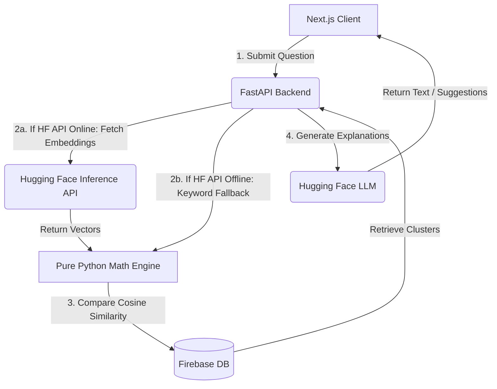

# LearnConnect AI: Semantic Question Finder & Auto-Tagger

LearnConnect AI is an advanced, full-stack web application designed for students to search past questions, automatically tag study topics, and generate intelligent suggestions. 

By utilizing remote Hugging Face Inference APIs, pure Python vector operations, and robust offline fallback algorithms, the backend operates with a near-zero memory footprint (<50 MB RAM)—making it fully compatible with Render's Free Tier limits (512MB).

* **Live Application:** [LearnConnect Web App](https://learnconnect-h30n.onrender.com/dashboard/ask-question)
* **Backend API URL:** `https://auto-tagging-gisul.onrender.com`
* **GitHub Repository:** [Similar-Question-Finder-with-Auto-Tagging-GISUL](https://github.com/ADhanaseelan/Similar-Question-Finder-with-Auto-Tagging-GISUL.git)

---

## 🚀 Features

- **Semantic Question Search**: Find related past questions based on their core *meaning* rather than exact keyword matches using `all-MiniLM-L6-v2` embeddings.
- **AI Auto-Tagging**: Questions are automatically categorized into educational subjects (e.g., Biology, Calculus, Operating Systems, Polity) using cosine vector math over custom taxonomic seeds.
- **Hugging Face LLM Generation**: Immediate context-aware answers and related follow-up study questions generated via `google/flan-t5-small`.
- **Hybrid Similarity Fallbacks**: In case of rate limits or offline development, the system seamlessly falls back to local Jaccard/keyword-similarity algorithms.
- **Interactive Knowledge Nodes**: Advanced, physics-based data visualizations mapping a user's semantic topic clusters over time using Framer Motion.
- **Firebase Database**: Secure real-time cloud data store for questions, user history, and profiles.

---

## 🔄 Project Architecture & Workflow



1. **User Request**: The student enters a natural language question in the Next.js React frontend.
2. **Dynamic Request Interception**: In production, the client-side fetch interceptor rewrites `/api/` endpoints to target the Render FastAPI backend.
3. **Remote Vectorization**: The backend fetches 384-dimensional sentence embeddings from Hugging Face's `all-MiniLM-L6-v2`. If the container network is not ready, the system utilizes a fast keyword-overlap classification.
4. **Vector Similarity Ranking**: The backend computes cosine similarity metrics against historical questions using pure-Python vector math (eliminating bulky packages like PyTorch, numpy, and scikit-learn).
5. **NoSQL Persistence**: The metadata, topic tag, and question clusters are saved to the Firebase Realtime Database.

---

## 🛠 Tech Stack

* **Frontend**: Next.js 15, Tailwind CSS, Framer Motion
* **Backend**: FastAPI (Python 3.9+), Uvicorn
* **Database**: Firebase Realtime Database (NoSQL JSON store)
* **Model Inference**: Hugging Face Inference API (`all-MiniLM-L6-v2` & `google/flan-t5-small`)

---

## 💻 Local Development Setup

### Prerequisites
* **Python 3.9+** (Fully compatible with type-hint specifications)
* **Node.js 18+**

### 1. Backend Setup
Create a virtual environment, install the lightweight dependencies, and run:
```bash
cd backend
python3 -m venv .venv

# Activate Virtual Environment
# Mac/Linux:
source .venv/bin/activate
# Windows:
.venv\Scripts\activate

# Install requirements
pip install -r requirements.txt

# Run server
python3 main.py
```
Create a `backend/.env` file with the following keys:
```env
FIREBASE_DB_URL=https://<your-db-name>.firebasedatabase.app
SECRET_KEY=yoursecretkeyhere
JWT_EXPIRE_DAYS=7
HF_TOKEN= # Optional: Your Hugging Face API Token (for higher rate-limits)
```
Add your Firebase service account JSON credentials to `backend/serviceAccountKey.json`.

### 2. Frontend Setup
Install package dependencies and launch the dev server:
```bash
cd frontend
npm install
npm run dev
```
Create a `frontend/.env.local` containing your public Firebase configuration keys:
```env
NEXT_PUBLIC_FIREBASE_API_KEY=your_api_key
NEXT_PUBLIC_FIREBASE_AUTH_DOMAIN=your_auth_domain.firebaseapp.com
NEXT_PUBLIC_FIREBASE_DATABASE_URL=https://your_db_name.firebasedatabase.app
NEXT_PUBLIC_FIREBASE_PROJECT_ID=your_project_id
NEXT_PUBLIC_FIREBASE_STORAGE_BUCKET=your_storage_bucket.appspot.com
NEXT_PUBLIC_FIREBASE_MESSAGING_SENDER_ID=your_sender_id
NEXT_PUBLIC_FIREBASE_APP_ID=your_app_id
NEXT_PUBLIC_FIREBASE_MEASUREMENT_ID=your_measurement_id

NEXT_PUBLIC_BACKEND_URL=http://localhost:8000
```

### 3. Concurrent Execution (Full Stack)
Alternatively, you can run both servers concurrently from the root directory:
```bash
npm run dev
```

---

## 🌐 Production Deployment

### 1. Backend Deployment (Render)
1. Set up a **Web Service** on Render pointing to your GitHub repository.
2. Select **Python** as the environment.
3. Configure the build parameters:
   * **Root Directory**: `backend`
   * **Build Command**: `pip install -r requirements.txt`
   * **Start Command**: `uvicorn main:app --host 0.0.0.0 --port $PORT`
4. Add the following environment variables:
   * `FIREBASE_CREDENTIALS`: Paste the *entire contents* of your `serviceAccountKey.json` file. The backend automatically cleans up any escaped newline formatting.
   * `FIREBASE_DB_URL`: Your Realtime Database URL.
   * `SECRET_KEY`: A secure signing key.

### 2. Frontend Deployment (Netlify / Vercel / Render Static Site)
Your frontend compiles as a dynamic web application.
1. Deploy your frontend repository (setting the build directory to the `frontend` folder).
2. Set the build parameters:
   * **Build Command**: `npm install && npm run build`
   * **Start Command**: `npm run start`
3. Define the build-time environment variable:
   * `NEXT_PUBLIC_BACKEND_URL`: `https://auto-tagging-gisul.onrender.com`

### 3. Firebase Authorized Domains configuration
Because Firebase Authentication locks out requests from unauthorized domains, you must register your frontend hosting URL:
1. Go to **Firebase Console** -> **Authentication** -> **Settings** -> **Authorized Domains**.
2. Click **Add domain** and enter your production frontend URL (e.g. `learnconnect-h30n.onrender.com`).
